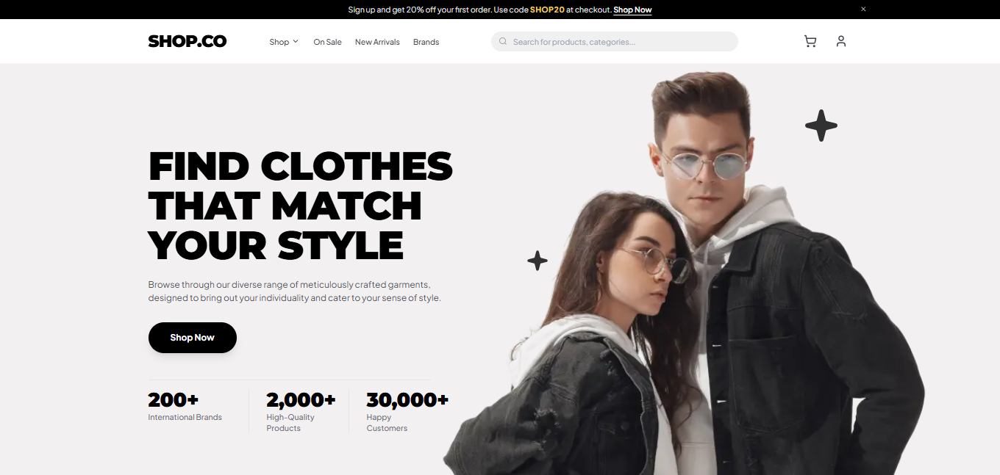

<div align="center">

# 🛍️ SHOP.CO — Modern E-Commerce Platform

[](https://nextjs.org/)
[](https://reactjs.org/)
[](https://www.typescriptlang.org/)
[](https://tailwindcss.com/)
[](https://e-commerce-shopco.vercel.app/)
[](https://opensource.org/licenses/MIT)

<p align="center">
  <strong>Find clothes that match your personal style.</strong><br>
  A high-performance, production-ready e-commerce web application featuring a rich 40-product catalog across Casual, Formal, Party, and Gym dress styles, dynamic search autocomplete, multi-attribute faceted filters, localStorage-backed cart persistence, user account portal, and enterprise-grade SEO architecture.
</p>

[🌐 **Live Website Demo**](https://e-commerce-shopco.vercel.app/) • [👨‍💻 **Developer Portfolio**](https://www.aliaskari.xyz/) • [✨ **GitHub Repository**](https://github.com/AliAskariGithub/shopco-uiux-hackathon) • [💼 **LinkedIn Profile**](https://www.linkedin.com/in/ali-askari-dev)

---

### 📸 Hero Section Preview
<p align="center">
  
</p>

</div>

---

## 📖 Table of Contents
- [Project Classification: Full-Stack vs. Frontend](#-project-classification-full-stack-vs-frontend)
- [Project Overview & Evolution](#-project-overview--evolution)
- [Complete Production-Ready SEO Architecture](#-complete-production-ready-seo-architecture)
- [Key Features & User Experience](#-key-features--user-experience)
- [Complete Product Catalog (40 Items)](#-complete-product-catalog-40-items)
- [Technology Stack](#-technology-stack)
- [Project Architecture & Directory Structure](#-project-architecture--directory-structure)
- [Getting Started Locally](#-getting-started-locally)
- [Performance, Accessibility & Code Quality](#-performance-accessibility--code-quality)
- [Personal Brand & Developer Social Links](#-personal-brand--developer-social-links)
- [License](#-license)

---

## 🏛️ Project Classification: Full-Stack vs. Frontend

**SHOP.CO is architected as a modern Hybrid Full-Stack / Frontend-Driven Web Application built on the Next.js 14 App Router.**

Understanding its exact architectural layers:

```
┌─────────────────────────────────────────────────────────────────────────┐
│                           BROWSER CLIENT                                │
│  • React 18 Concurrent UI      • CartContext (localStorage)             │
│  • Live Search Autocomplete    • Faceted Catalog Filtering & Sorting    │
│  • Interactive Reviews Modal   • Product Gallery Thumbnail Switcher     │
└────────────────────────────────────▲────────────────────────────────────┘
                                     │ Hydration & Data
┌────────────────────────────────────▼────────────────────────────────────┐
│                  NEXT.JS 14 APP ROUTER SERVER LAYER                     │
│  • Static Site Generation (SSG via generateStaticParams)                │
│  • Dynamic Metadata & OpenGraph Engine (generateMetadata)               │
│  • Programmatic Robots Directive (app/robots.ts -> /robots.txt)         │
│  • Programmatic XML Sitemap Generator (app/sitemap.ts -> /sitemap.xml)  │
│  • Schema.org JSON-LD Structured Data Injection (Product, Store, Bread) │
│  • Google Search Console Verification Header Engine                     │
└────────────────────────────────────▲────────────────────────────────────┘
                                     │ Abstracted Repository Interface
┌────────────────────────────────────▼────────────────────────────────────┐
│                         DATA & PERSISTENCE LAYER                        │
│  • Centralized Typed In-Memory Repository (data/products.ts)            │
│  • 40 Curated Fashion Items across Casual, Formal, Party, and Gym       │
│  • Plug-and-Play Readiness: Ready for PostgreSQL (Neon/Prisma),        │
│    Firebase/Firestore, MedusaJS, or Shopify Storefront API              │
└─────────────────────────────────────────────────────────────────────────┘
```

### 1. The Full-Stack Server Capabilities
- **Static Site Generation (SSG) & Pre-Rendering**: Dynamic product routes (`app/Product/[id]/page.tsx`) utilize `generateStaticParams()` to statically pre-render all 40 products at build time, yielding near-instant TTFB (Time to First Byte) and 100% crawlability.
- **Server-Driven Dynamic Metadata (`generateMetadata`)**: Generates tailored page titles, meta descriptions, canonical URLs, and OpenGraph/Twitter Card images on the server before dispatching HTML to crawlers.
- **Programmatic Search Robot Endpoints**:
  - `app/robots.ts` compiles dynamically into `/robots.txt`, enforcing crawl rules (allowing public pages while disallowing private `/Cart` and `/account`).
  - `app/sitemap.ts` programmatically builds `/sitemap.xml`, mapping all 40 dynamic products, category queries, and dress style landing pages with `lastModified`, `changeFrequency`, and `priority` directives.
- **Server-Injected Structured Data**: Server Components inject Schema.org JSON-LD definitions for `OnlineStore`, `WebSite`, `Product`, `BreadcrumbList`, and `Person` before sending the response payload.
- **Enterprise Verification Headers**: Injects site ownership verification tags directly into the server `<head>`.

### 2. The Frontend Client Capabilities
- **React 18 Concurrent Rendering**: Highly responsive UI with fluid transitions, modal dialogs, and smooth scrolling.
- **Global State Orchestration (`CartContext`)**: Synchronizes cart contents, item counts, size/color variant selections, quantity modifications, promo code deductions, and simulated checkout state with browser `localStorage`.
- **Instant Search & Autocomplete**: Real-time fuzzy query filtering with an interactive dropdown surfacing product matches, style labels, and pricing directly in the header.
- **Multi-Attribute Faceted Catalog Filtering**: Client-side filtering across collections (On Sale, New Arrivals, Top Selling), 4 dress styles, 5 clothing categories, dual-handle price sliders ($50–$300), 10 color swatches, 5 sizes, and 5 sorting algorithms.
- **Interactive Review System**: Modal form allowing users to submit new verified buyer reviews with interactive 5-star ratings and instant state updates.

---

## 🚀 Project Overview & Evolution

**SHOP.CO** was initially created as a hackathon concept exploring modern fashion e-commerce design patterns inspired by Figma. Over time, it was modernized into an enterprise-grade web application:

1. **Architecture Overhaul**: Removed 16 redundant boilerplate directories (`app/Product/Product1` through `Product16`) and unified them into a robust Next.js dynamic routing pattern (`app/Product/[id]/page.tsx`), maintaining complete backwards compatibility with legacy URL patterns.
2. **Complete 40-Product Catalog**: Expanded the catalog from 4 initial placeholders to 40 fully detailed items evenly distributed across **Casual**, **Formal**, **Party**, and **Gym** styles with realistic specs, care guides, and reviews.
3. **Hero Section Refinement**: Replaced mismatched assets with a pixel-perfect, high-resolution transparent model photograph flush with the bottom boundary, animated decorative sparkles, and dynamic stats counters.
4. **Infinite Marquee**: Built a continuous right-to-left moving marquee showcasing premier luxury brands (Versace, Zara, Gucci, Prada, Calvin Klein) with hover-pause functionality.
5. **Shop Mega Dropdown**: Added a multi-column floating mega menu giving instant access to all styles, categories, and curations.
6. **Curated 4-Item Shelves**: Tailored the homepage shelves for **New Arrivals**, **Top Selling**, and **On Sale** to showcase exactly 4 preview items, with animated "View All" pill buttons linking directly into the pre-filtered catalog.
7. **User Account Portal (`/account`)**: Built an interactive customer dashboard featuring active order tracking, order history, address management, saved payment methods, and user settings.

---

## 🎯 Complete Production-Ready SEO Architecture

The platform has been audited and engineered for optimal search engine visibility, indexability, and social sharing:

### 1. Google Search Console Verification
Configured directly in the global application metadata:
```html
<meta name="google-site-verification" content="r2WPUKMX4DZtyfc_JaPMa1b8Skk5M1OdUwGDWxDZ1to" />
```

### 2. Search Directives: `robots.txt` & `sitemap.xml`
- **Robots Directives ([`app/robots.ts`](file:///d:/Project/shopco-uiux-hackathon/app/robots.ts))**:
  - Allows all major web spiders (`*`, Googlebot, Bingbot) to crawl public landing pages, style archives, and product detail pages.
  - Strictly disallows private customer routes: `/Cart` and `/account`.
  - Links to the canonical XML sitemap location (`https://e-commerce-shopco.vercel.app/sitemap.xml`).
- **Dynamic XML Sitemap ([`app/sitemap.ts`](file:///d:/Project/shopco-uiux-hackathon/app/sitemap.ts))**:
  - Dynamically traverses the catalog to index all 40 products (`/Product/Product${id}`).
  - Maps core landing pages: `/`, `/Product`, `/Product?style=Casual`, `/Product?style=Formal`, `/Product?style=Party`, `/Product?style=Gym`.
  - Sets accurate `lastModified` timestamps, `changeFrequency` (`daily` / `weekly`), and hierarchical `priority` scores (`1.0` for root, `0.9` for catalog, `0.8` for styles, `0.7` for products).

### 3. Schema.org JSON-LD Structured Data
Injected across pages for rich Google search results (Rich Snippets, Sitelinks Searchbox, Merchant Badges):
- **`OnlineStore` Schema**: Defines brand identity, legal website URL, official logo, customer contact points, and verified creator social profiles.
- **`WebSite` & `SearchAction` Schema**: Enables Google's Sitelinks Searchbox targeting `https://e-commerce-shopco.vercel.app/Product?search={search_term_string}`.
- **`Product` Schema (Per-Product)**: Detailed product specifications including `name`, `image`, `description`, `sku`, `mpn`, `brand` (SHOP.CO), `offers` (price, USD currency, in-stock availability, price validity), and `aggregateRating` (star rating, review count).
- **`BreadcrumbList` Schema**: Hierarchical breadcrumb navigation paths (`Home` > `Shop` > `[Style]` > `[Product Name]`).
- **`Person` Schema**: Explicit founder entity attributing the application to **Syed Ali Askari** with cross-network `sameAs` references.

### 4. Comprehensive Open Graph & Twitter Cards
- **Open Graph**: Title templates, localized `en_US` definitions, canonical page URLs, and high-resolution 1200×630 preview card assets.
- **Twitter Cards**: `summary_large_image` configuration with author handle attribution (`@Syed_Ali_Askari`).

### 5. Semantic HTML & Accessibility (WCAG 2.1)
- **Heading Outline**: Single top-level `<h1>` in the hero section, semantic `<h2>` headings for homepage sections and catalog headers, and `<h3>` for individual cards.
- **Descriptive Image Alt Text**: Every product image, brand logo, and lifestyle visual contains descriptive, contextual alt text without keyword stuffing.
- **Screen Reader Support**: Hidden `.sr-only` descriptive labels on icon-only buttons, interactive swatches, and bento style cards.

---

## ✨ Key Features & User Experience

### 🛍️ 1. Dynamic Product Architecture
- **Unified Route (`/Product/[id]`)**: Supports both numeric IDs (`/Product/12`) and legacy slugs (`/Product/Product12`).
- **Multi-Thumbnail Interactive Gallery**: Seamless switching between multiple product views.
- **Technical Specifications**: Fabric composition, fit type, care instructions, and manufacturing origin.
- **Animated Tabs**: Smooth tab transitions between **Product Details**, **Rating & Reviews**, and **FAQs**.
- **Interactive Review Submission**: Users can leave their name, email, star rating, and written review with live submission feedback.

### 🔍 2. Real-Time Search, Mega Menu & Faceted Filters
- **Shop Mega Dropdown**: Multi-column menu organized by Dress Styles (Casual, Formal, Party, Gym), Categories (T-Shirts, Shirts, Jeans, Shorts, Hoodies), and Curations (On Sale, New Arrivals, Top Selling).
- **Instant Navbar Search Autocomplete**: Fuzzy query search matching product titles, categories, and styles with clickable thumbnail cards.
- **Multi-Attribute Filters**:
  - Special collections (All, On Sale, New Arrivals, Top Selling).
  - Dress style selectors (Casual, Formal, Party, Gym).
  - Category filters (T-shirts, Shirts, Shorts, Hoodies, Jeans).
  - Dual-handle price slider ($50 to $300).
  - Color palette swatches with intelligent shade grouping.
  - Size selectors (Small to XXL).
  - Sorting modes (Most Popular, Newest Arrivals, Price Low-to-High, Price High-to-Low, Highest Rated).
  - Active filter chips with individual removal and one-click "Clear All".
  - Slide-out mobile filter drawer.

### 🛒 3. Global Cart & Checkout Flow
- **Persistent Storage**: Global cart state backed by browser `localStorage`.
- **Interactive Stepper**: Real-time quantity adjustment, item removal, and instant recalculation of subtotal, discounts, flat shipping, and order total.
- **Promo Code Engine**: Built-in promotional coupon validation (`SHOP20` for 20% off).
- **Order Placement Simulation**: Interactive modal collecting shipping details and generating an order confirmation number (e.g. `#SHOPCO-849201`).
- **Toast Notifications**: Interactive floating alerts when items are added or updated in the cart.

### 👤 4. User Account Portal (`/account`)
- Direct access from the navigation bar account icon.
- Order history with status tags (*Delivered*, *In Transit*, *Processing*), item breakdowns, and re-order shortcuts.
- Saved shipping addresses management.
- Saved payment methods and credit card manager.
- Profile and notification preferences.

---

## 👔 Complete Product Catalog (40 Items)

The application features 40 typed, high-quality apparel items across 4 core dress styles:

| ID | Product Name | Style | Category | Price | Rating | Key Highlights |
| :---: | :--- | :---: | :---: | :---: | :---: | :--- |
| **01** | T-shirt with Tape Details | Casual | T-shirts | $120 | 4.5 ★ | Combed heavyweight cotton, sleeve tape accents |
| **02** | Skinny Fit Stretch Jeans | Casual | Jeans | $240 | 3.5 ★ | 4-way micro-stretch denim, sculpted contour |
| **03** | Checkered Flannel Shirt | Casual | Shirts | $180 | 4.5 ★ | Double-brushed cotton flannel, horn buttons |
| **04** | Sleeve Striped T-shirt | Casual | T-shirts | $130 | 4.5 ★ | Ring-spun organic cotton, contrast ringing |
| **05** | Vertical Striped Shirt | Casual | Shirts | $212 | 5.0 ★ | French linen blend, airy resort camp collar |
| **06** | Courage Graphic T-shirt | Casual | T-shirts | $145 | 4.0 ★ | Enzyme-washed jersey, vintage typography |
| **07** | Loose Fit Bermuda Shorts | Casual | Shorts | $80 | 3.0 ★ | Durable chino twill, relaxed knee length |
| **08** | Faded Skinny Jeans | Casual | Jeans | $210 | 4.5 ★ | Hand-whiskered denim, copper rivets |
| **09** | Mock Neck Zipper Sweatshirt | Casual | Hoodie | $150 | 4.2 ★ | Brushed fleece interior, quarter-zip collar |
| **10** | Classic Crewneck Everyday Tee | Casual | T-shirts | $95 | 4.6 ★ | 100% Pima cotton, pre-shrunk construction |
| **11** | Navy Monarch Tailored Shirt | Formal | Shirts | $165 | 4.9 ★ | Egyptian Giza cotton twill, Italian tailoring |
| **12** | Emerald Executive Oxford Shirt | Formal | Shirts | $175 | 4.8 ★ | Royal oxford cloth, cutaway collar |
| **13** | Charcoal Heritage Dress Shirt | Formal | Shirts | $155 | 4.7 ★ | Mercerized cotton & stretch silk, satin sheen |
| **14** | Imperial Plum Tailored Shirt | Formal | Shirts | $185 | 4.9 ★ | Superfine micro-herringbone weave, gala cut |
| **15** | Burgundy Regency Formal Shirt | Formal | Shirts | $190 | 4.8 ★ | High-density poplin, hidden button placket |
| **16** | Slate Silver Executive Shirt | Formal | Shirts | $160 | 4.6 ★ | Wrinkle-resistant Pima cotton, seamless stays |
| **17** | Amber Bronze Tuxedo Shirt | Formal | Shirts | $215 | 5.0 ★ | 90% Mulberry silk with gold accents |
| **18** | Viscose Blend Dress Shirt | Formal | Shirts | $140 | 4.5 ★ | Tailored drape, breathable evening profile |
| **19** | Pleated Tailored Wool Trousers | Formal | Jeans | $260 | 4.9 ★ | Vitale Barberis Canonico Super 130s wool |
| **20** | Classic Oxford Sartorial Trousers | Formal | Jeans | $195 | 4.7 ★ | Compact cotton gabardine, curtained waistband |
| **21** | Midnight Metallic Party Shirt | Party | Shirts | $195 | 4.8 ★ | Silk chiffon with metallic lurex threads |
| **22** | Emerald Glitz Club Shirt | Party | Shirts | $180 | 4.9 ★ | High-luster satin sheen, fluid camp collar |
| **23** | Golden Sparkle Disco Top | Party | Shirts | $210 | 5.0 ★ | Micro-shimmer weave, smoked pearl buttons |
| **24** | Ruby Red Velvet Lounge Shirt | Party | Shirts | $225 | 4.7 ★ | Plush crushed velvet, silk inner lining |
| **25** | Amethyst Hologram Party Shirt | Party | Shirts | $190 | 4.8 ★ | Optical two-tone shifts under dance lighting |
| **26** | Champagne Glow Cocktail Shirt | Party | Shirts | $175 | 4.6 ★ | Micro-modal twill, pearlescent sunset finish |
| **27** | Electric Cyan Rave Shirt | Party | Shirts | $165 | 4.9 ★ | UV-reactive micro-polyester, quick-dry face |
| **28** | Rose Gold Stellar Evening Shirt | Party | Shirts | $205 | 4.8 ★ | Silk georgette with copper filaments |
| **29** | Bronze Velour Festival Top | Party | Shirts | $185 | 4.7 ★ | Tactile cotton velour, retro camp lapels |
| **30** | Neon Night Statement Tee | Party | T-shirts | $110 | 4.5 ★ | Glow-in-the-dark silkscreen graphics |
| **31** | Aero Blue Performance Tee | Gym | T-shirts | $75 | 4.9 ★ | AeroMesh moisture evacuation, anti-chafe seams |
| **32** | Neon Volt Speed Compression Top | Gym | T-shirts | $85 | 4.8 ★ | Graduated compression, twilight visibility |
| **33** | Crimson Power Lifting Tee | Gym | T-shirts | $78 | 4.7 ★ | Silicone barbell back grip, reinforced shoulders |
| **34** | Cobalt Hybrid Workout Shirt | Gym | T-shirts | $82 | 4.9 ★ | Micro-perforated back airflow, gym-to-street |
| **35** | Ultraviolet Endurance Runner Tee | Gym | T-shirts | $90 | 4.8 ★ | 98g ultralight, silver-ion antibacterial grid |
| **36** | Solar Orange Training Top | Gym | T-shirts | $70 | 4.6 ★ | Brushed peach microfiber, underarm gussets |
| **37** | Arctic Ice Cooling Gym Shirt | Gym | T-shirts | $88 | 4.9 ★ | Jade-infused mineral cooling technology (-3°F) |
| **38** | Stealth Tactical Dry-Fit Tee | Gym | T-shirts | $80 | 4.7 ★ | Ripstop overlays, integrated earbud loop |
| **39** | Magenta Flex Agility Top | Gym | T-shirts | $84 | 4.8 ★ | 360-degree flex zones for gymnastics & drills |
| **40** | Pro Glide Athletic Training Joggers | Gym | Jeans | $135 | 4.9 ★ | DWR water-repellent stretch, zip phone pockets |

---

## 🛠️ Technology Stack

| Layer | Technology | Details & Purpose |
| :--- | :--- | :--- |
| **Framework** | [Next.js 14](https://nextjs.org/) (App Router) | Server & Client Components, SSG, programmatic SEO (`robots.ts`, `sitemap.ts`) |
| **UI Library** | [React 18](https://react.dev/) | Concurrent UI rendering, Context API global state |
| **Language** | [TypeScript 5](https://www.typescriptlang.org/) | Strict type contracts across products, reviews, filters, and carts |
| **Styling** | [Tailwind CSS 3](https://tailwindcss.com/) | Mobile-first responsive utilities, custom animations, keyframe marquee |
| **Typography** | [Plus Jakarta Sans](https://fonts.google.com/specimen/Plus+Jakarta+Sans) & [Montserrat](https://fonts.google.com/specimen/Montserrat) | Optimized variable web fonts loaded via `next/font/google` |
| **Icons** | [Lucide React](https://lucide.dev/) & [React Icons](https://react-icons.github.io/react-icons/) | Modern SVG icons and verified brand emblems |
| **Carousel** | [Embla Carousel](https://www.embla-carousel.com/) | High-performance touch sliders with responsive paging |
| **Storage** | Browser `localStorage` | Client-side cart persistence and state hydration |
| **Hosting & CI/CD** | [Vercel](https://vercel.com/) | Edge-optimized deployment network with automated CI/CD builds |

---

## 📁 Project Architecture & Directory Structure

```text
shopco-uiux-hackathon/
├── app/
│   ├── account/
│   │   ├── layout.tsx         # Account metadata (noindex, follow)
│   │   └── page.tsx           # User account dashboard (orders, addresses, settings)
│   ├── Cart/
│   │   ├── layout.tsx         # Shopping cart metadata (noindex, follow)
│   │   └── page.tsx           # Shopping cart, quantity steppers, promo codes, checkout
│   ├── Product/
│   │   ├── [id]/
│   │   │   └── page.tsx       # Server Component: SSG pre-rendering, Product & Breadcrumb Schema
│   │   ├── layout.tsx         # Catalog layout metadata & canonical URL definition
│   │   └── page.tsx           # Filterable catalog with search, price slider, & sorting
│   ├── globals.css            # Custom marquee keyframes, animations, & scrollbar styling
│   ├── layout.tsx             # Root layout: GSC verification, Store & WebSite JSON-LD, fonts
│   ├── page.tsx               # Homepage (Hero, Brands Marquee, Arrivals, On Sale, Bento Grid)
│   ├── robots.ts              # Programmatic robots.txt with crawling rules & sitemap declaration
│   └── sitemap.ts             # Programmatic sitemap.xml indexing all 40 products and static routes
├── components/
│   ├── ui/                    # Reusable UI primitives (breadcrumb, button, carousel)
│   ├── Arrivals.tsx           # New Arrivals showcase shelf (4 curated items + "View All")
│   ├── DressStyle.tsx         # Bento Grid with Casual, Formal, Party, and Gym style cards
│   ├── Footer.tsx             # Semantic footer with newsletter signup, payment badges, social links
│   ├── Header.tsx             # Container for Topbar and Navbar
│   ├── Hero.tsx               # Flush hero section, stats counters, CTA, and brand marquee
│   ├── Navbar.tsx             # Navigation bar with real-time search autocomplete & Shop mega menu
│   ├── OnSale.tsx             # Discounted products shelf (4 curated items + "View All")
│   ├── ProductCard.tsx        # Reusable product card with star ratings and quick-add
│   ├── ProductDetailClient.tsx# Client component: image gallery, color/size picker, reviews, tabs
│   ├── ReviewCard.tsx         # Verified customer testimonial card
│   ├── Testimonial.tsx        # Responsive customer testimonials carousel
│   ├── Toast.tsx              # Unobtrusive alert toast notification system
│   ├── Topbar.tsx             # Dismissible top announcement banner
│   └── TopSellling.tsx        # Top Selling products shelf (4 curated items + "View All")
├── context/
│   └── CartContext.tsx        # Global cart state with localStorage persistence
├── data/
│   └── products.ts            # Centralized typed catalog of 40 products + query utilities
├── public/
│   ├── card01.png..card05.png # Payment gateway badges (Visa, PayPal, MC, Apple Pay, G-Pay)
│   ├── comp-logo-1..5.png     # Brand logos (Versace, Zara, Gucci, Prada, Calvin Klein)
│   ├── frame01.png..frame04.png # Dress style category cards (Casual, Formal, Party, Gym)
│   ├── hero-models-transparent.png # High-resolution hero fashion models asset
│   ├── hero-preview.png       # 1200x630 OpenGraph and preview card asset
│   └── images/                # 42 high-resolution local apparel assets
└── hero-preview.png           # High-resolution README preview banner
```

---

## 💻 Getting Started Locally

### 1. Prerequisites
- **Node.js**: `v18.17.0` or higher (`Node 20 LTS` recommended)
- **Package Manager**: `npm`, `yarn`, or `pnpm`

### 2. Clone the Repository
```bash
git clone https://github.com/AliAskariGithub/shopco-uiux-hackathon.git
cd shopco-uiux-hackathon
```

### 3. Install Dependencies
```bash
npm install
```

### 4. Run Development Server
```bash
npm run dev
```
Open [http://localhost:3000](http://localhost:3000) in your browser.

### 5. Build for Production
```bash
npm run build
npm run start
```

### 6. Run Quality Checks
```bash
npx tsc --noEmit
npm run lint
```

---

## ⚡ Performance, Accessibility & Code Quality

- **100% Local Optimized Assets**: Zero external image dependencies. Every product visual and brand logo is packaged locally in `public/` and served through Next.js Image optimization (`next/image`) with WebP/AVIF generation, blur placeholders, and responsive sizing.
- **Strict Semantic HTML**: Built strictly with semantic elements (`<header>`, `<nav>`, `<main>`, `<section>`, `<article>`, `<footer>`).
- **Accessible Design (WCAG 2.1 AA)**: Interactive elements have descriptive `aria-label` tags, focus states, and high-contrast color ratios.
- **Micro-Interactions**: Smooth button hover animations, tab transition fades, and hover-pause marquee interactions.

---

## 🌐 Personal Brand & Developer Social Links

Developed and maintained by **Syed Ali Askari**:

| Platform | Link |
| :--- | :--- |
| 🌐 **Portfolio Website** | [https://www.aliaskari.xyz/](https://www.aliaskari.xyz/) |
| 💼 **LinkedIn** | [https://www.linkedin.com/in/ali-askari-dev](https://www.linkedin.com/in/ali-askari-dev) |
| 🐙 **GitHub** | [https://github.com/AliAskariGithub](https://github.com/AliAskariGithub) |
| 🐦 **X (formerly Twitter)** | [https://x.com/Syed_Ali_Askari](https://x.com/Syed_Ali_Askari) |
| 📘 **Facebook** | [https://www.facebook.com/profile.php?id=61564881342854](https://www.facebook.com/profile.php?id=61564881342854) |
| 📷 **Instagram** | [https://www.instagram.com/syedaliaskarizaidi__/](https://www.instagram.com/syedaliaskarizaidi__/) |

---

## 📄 License

This project is open source and available under the [MIT License](LICENSE).

<div align="center">
  <sub>Designed with precision & engineered with ❤️ by <strong>Syed Ali Askari</strong></sub>
</div>
